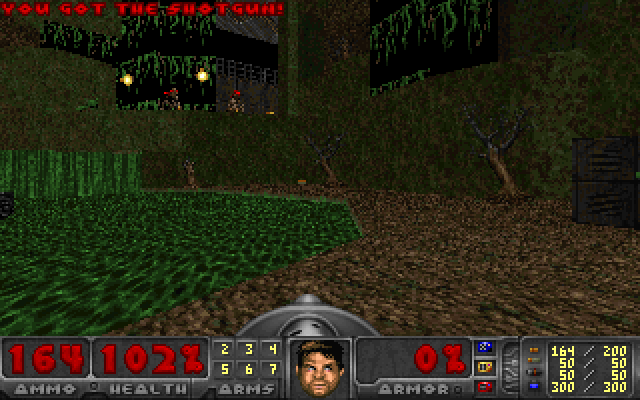
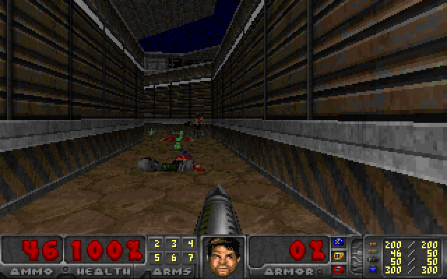
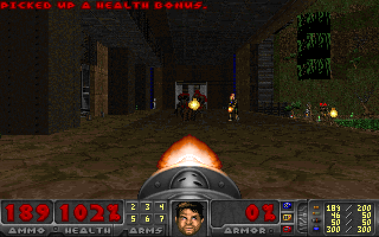

# Sail runs Doom on DataFusion with a single query

[Sail](https://github.com/lakehq/sail) is a Spark-compatible compute engine written in Rust on [Apache DataFusion](https://datafusion.apache.org/): PySpark and Spark SQL clients connect to it over Spark Connect, and DataFusion executes what they send. This week Sail played Doom. Freedoom's first level, 1,200 tics of it, ran as one SQL query: a `WITH RECURSIVE` whose rows are the whole game world, where each step of the recursion is one 35 Hz game tic. Movement, doors and lifts, pickups, three weapons, rockets, imps throwing fireballs, monsters chasing and dying, barrels setting off barrels. The world the query computes matches the original implementation's row for row at every tic, and Sail renders every frame of it too, in SQL. The code is [`querygraph/saildoom`](https://github.com/querygraph/saildoom), and the [video](https://github.com/querygraph/saildoom/releases/download/v0.2-game/saildoom-e1m1-played-on-sail.mp4) is the whole run, every tic computed and every frame drawn by Sail.

The original is [SQLDoom](https://github.com/cedardb/sqldoom), CedarDB's port of Doom to SQL, covered by Ars Technica as ["Can it run Doom? SQL database edition"](https://arstechnica.com/gaming/2026/10/can-it-run-doom-sql-database-edition/). SQLDoom renders each frame with one 89-CTE query on CedarDB and advances the game with about 5,900 lines of CedarScript, CedarDB's procedural language, updating some 40 tables in place every tic. Sail has no procedures and no in-place `UPDATE` on tables in a query, and Sail `main` does not yet have recursive CTEs. So the port has two halves that run on two builds of Sail. The renderer runs on unmodified Sail `main`. The game runs on a public Sail branch, [`querygraph/sail` `work/recursive-cte`](https://github.com/querygraph/sail/tree/work/recursive-cte), that adds `WITH RECURSIVE` and the CTE handling a query of this size needs.



## The renderer: 89 CTEs in Spark SQL

The first half is SQLDoom's renderer, ported to Spark SQL and run on Sail `main`. It is a raycaster over the BSP: for each of 320 screen columns it finds the wall segments in view, clips them, picks textures and light, then fills floors, ceilings, sprites and the status bar, all as joins and window functions over the map's tables.

The SQL is the same and the dialect is not. Postgres divides integers as integers and casts floats to integers its own way, so those became explicit (`DIV`, `bround`). `generate_series` became a guarded `explode(sequence(...))`, `GET_BYTE` on texture blobs became a join on a table of texels, and `LATERAL ... LIMIT 1` became a window and a join. That stage-by-stage port is pixel-exact and takes 9.8 seconds a frame. Most of that is Sail inlining a CTE at every reference while SQLDoom reads its heavy stages many times. A restructured renderer computes the same pixels reading each stage once, in 0.7 seconds a frame, and nearly all of that is planning. A batch form plans once for many frames, with every stage keyed by frame: 41 milliseconds a frame from one client, and 38.8 frames a second from four clients rendering concurrently on a 10-core M1 Max. That is above Doom's 35.

Every frame is checked against CedarDB's frame for the same world state, pixel by pixel. Of the 1,201 frames of the run described below, 1,151 are identical in all 64,000 pixels. Of the other 50, 49 differ by a handful of pixels: each traces to the last bit of a `cos` or `tan` where Apple's libm (Sail on macOS) and glibc (CedarDB in Linux) disagree. One frame draws the floor under the player with the wrong flat. That one is a renderer bug we have not fixed yet.

Along the way the renderer hit a Sail panic on `CASE` over arrays of structs, filed as [lakehq/sail#2742](https://github.com/lakehq/sail/issues/2742).

## The game: the world as one relation

A recursive CTE produces one relation, and SQLDoom's tic updates many tables. So the port holds the world as one relation, `(tic, kind, p, s, m, ..., z)`: a `kind` says which table a row belongs to, and one struct column per kind holds the row. There are twenty kinds: the player, sectors, sector movers, queued line events, one-shot activations, switch buttons, sidedefs, render segs, Things, their health, monster AI, render Things, effects, the weapon state, owned weapons, picked-up items, secrets, automap lines, projectiles and monster deaths. The anchor of the recursion is tic 0. The recursive term unpacks the previous tic's rows into one CTE per table and runs SQLDoom's stages in its order, as CTE chains, then packs the next version of every table back into rows:

```sql
WITH RECURSIVE world AS (
  SELECT ... FROM tic 0                         -- the recorded start
  UNION ALL
  SELECT * FROM (
    WITH RECURSIVE prev AS (SELECT * FROM world),
         P0 AS (SELECT tic + 1 AS ntic, p.* FROM prev WHERE kind = 'P'),
         ...                                    -- clock, use, specials, doors,
         ...                                    -- movement, pickups, weapons,
         ...                                    -- projectiles, monsters, physics
         step AS (...)                          -- every table's next version
    SELECT * FROM step
  ) s
  WHERE s.tic <= 1200
)
SELECT * FROM world
```

SQLDoom's procedural parts translate mechanically. A CedarScript `if` on a stage bit becomes a CTE of the tics on which that stage runs, joined in where the stage's output replaces its input. An `UPDATE` becomes a join that produces the row's next version. An `INSERT ... ON CONFLICT DO UPDATE` becomes the old rows with the conflicting ones changed, plus an anti-join for the new ones. The monster AI's sound propagation, which floods outward through open sectors, becomes a recursive CTE inside the recursive CTE. Doom's random numbers come from SQLDoom's own choice: a table of Doom's 256 values indexed by a hash of actor, tic and call site, which a set-based engine can reproduce exactly.

The tic is about 3,000 lines of Spark SQL in six files: [`tic_doors.sql`](https://github.com/querygraph/saildoom/blob/7544dbf2c49285bf2b063756ecfe098525ec5e10/sql/tic_doors.sql), `tic_step.sql`, `tic_combat.sql`, `tic_projectiles.sql`, `tic_monsters.sql` and `tic_out.sql`. They are written out like that rather than generated, so they read like SQLDoom's stages.



## Exact means exact

The reference is a 1,200-tic run of Freedoom's E1M1 played on CedarDB by a small bot, with SQLDoom's world snapshotted after every tic. The bot fires 45 shots with the chaingun, shotgun and rocket launcher, kills 14 monsters, opens doors, rides a lift, picks things up and finds a secret. Imps throw fireballs at it, and barrels go off in a chain. Only two things from that recording go into Sail: the world at tic 0 and the bot's input at each tic.

There are two checks. Step mode computes every tic from CedarDB's state at the previous tic, so a stage that is wrong shows up at the first tic it is wrong. Recursive mode runs the whole game on Sail alone, from tic 0, so an error anywhere carries forward. Both compare all twenty tables, every row and every column, at every tic. In both modes every one of them matches CedarDB, and every pose of the camera matches too. Rendered, the Sail-played run gives the same frames, byte for byte, as Sail rendering CedarDB's recorded world.

Getting there meant matching CedarDB's arithmetic, not Postgres's. SQLDoom keeps positions, momenta and velocities in `real` columns, and CedarDB keeps arithmetic on them in single precision more often than Postgres would. A `real` combined with an integer or a decimal literal stays `real`, and so do `POWER` and `SQRT` of a `real`. Casts to integers truncate, and `ROUND` of a double rounds half away from zero. Each of these was found by a tic that disagreed and confirmed by probing CedarDB directly. The port spells them out, for example a single-precision distance where SQLDoom writes `SQRT(POWER(dx, 2) + POWER(dy, 2))` on `real`s. One more lived in the client. The bot's floating-point commands reach CedarDB as decimal text, which rounds to `real` directly, while rounding them through a double first is one ulp away now and then. The port reads the commands back from CedarDB's `game_tic_commands`.



## What the game found in the engine

A query this size exercises an engine differently from benchmarks, and three problems surfaced that only a long recursion shows. All three are fixed on the branch, each with a regression test in Sail's own suite, whose 5,375 feature tests pass.

- Planning grew exponentially. The branch computes a CTE that is referenced more than once only once, instead of inlining it at every reference. But it treated any CTE that read the recursive query's working table as part of the recursion itself, and inlined those. Inside the tic, every CTE derives from the previous tic, and chains like the door stage's (each version of the movers built from the one before, read several times) multiplied into a plan that never finished planning. The fix shares them like any other CTE and computes them again for each iteration.
- A shared CTE defined outside an inner recursive query, the sound flood, was reset from inside it on every inner iteration, and the next read ran an already-consumed plan again. Now the node that owns a shared CTE resets it, and a reference never does.
- A barrel that should have killed its neighbours did nothing, on the second iteration and every one after it. DataFusion's `AggregateExec` pushes a dynamic filter into its input scan for `MIN` and `MAX`, tightening it as it goes, and keeps that filter when a recursive query resets the plan for its next iteration. So the next iteration scans with the bound the previous one learned: `MAX(blast_radius)` saw `blast_radius > 128`, found nothing, and the blast had no radius. That one is DataFusion's, reproduced in plain DataFusion 55.1 and filed as [apache/datafusion#26054](https://github.com/apache/datafusion/issues/26054). The branch turns that pushdown off in plans that hold a recursive query.

The branch also measures well outside Doom. The renderer ported stage by stage runs 2.5 times faster on it, because its repeated CTEs are computed once instead of inlined. TPC-DS at scale factor 1, on the 22 queries that reuse a CTE, gives the same results as `main`, in the same time within measurement noise.

## How fast, and what is left

The whole run, 1,200 tics, takes 202 seconds as one recursive query on one client: 168 milliseconds a tic, about six tics a second against Doom's 35. Computing every tic from CedarDB's recorded state, with no dependence between tics, takes 18 seconds for all 1,200 in one query. SQLDoom on CedarDB plays interactively. Sail plays the game exactly, but not yet at the speed a player needs. Rendering runs at 41 milliseconds a frame in batches, so a Sail-played run is something to compute and then watch.

What E1M1 never reaches is not ported: teleporters, crushers, stairs, light and donut specials, Nightmare's monster respawns, E1M8's boss floor, and deathmatch. They are written in SQLDoom the same way as everything that is ported, and the checks that validated the rest are what would validate them.

The port is in [`querygraph/saildoom`](https://github.com/querygraph/saildoom/tree/7544dbf2c49285bf2b063756ecfe098525ec5e10), and the Sail branch with recursive CTEs is [`querygraph/sail` `work/recursive-cte`](https://github.com/querygraph/sail/tree/9c41ac02754d5c84dd769897bc3478300ccee060). The [video of the run](https://github.com/querygraph/saildoom/releases/download/v0.2-game/saildoom-e1m1-played-on-sail.mp4), every tic computed and every frame drawn by Sail, is on the [v0.2-game release](https://github.com/querygraph/saildoom/releases/tag/v0.2-game). All the credit for Doom in SQL belongs to CedarDB's SQLDoom: Sail runs their game, and checks itself against it at every tic.
